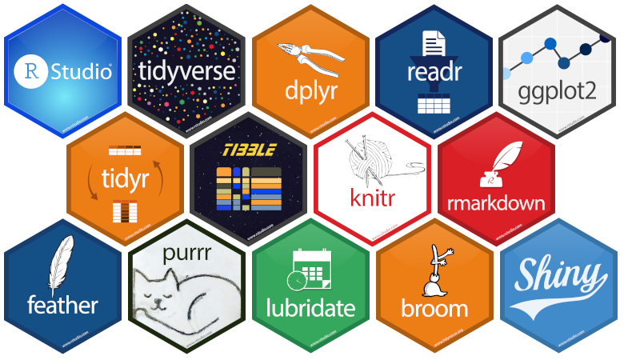

<!--  -->

```{r echo=FALSE, fig.align='center'}
knitr::include_graphics("data_analisis.png")
```


Este es un curso que forma parte del programa de capacitaciones y entrenamiento de **The Nature Conservancy Perú** en Análisis de datos en R.

El curso esta diseñado para un entrenamiento intensivo de corta duración (1 semana) el cual tiene como objetivo brindar una **introducción breve** a los **principios de la ciencia de datos** desde la recolección de información del ambiente hasta reportar los análisis en diferentes formatos (word, html, pdf). Los datos empleados estan orientado a temas marinos. Sin embargo, la forma lógica de programación del presente curso puede ser empleado en diferentes ámbitos. Aqui nos enfocaremos principalmente en las áreas de **Programación computacional**, **Exploración de datos**, **Visualización** y **Documentación**.

Cada una de las presentaciones del curso se iran añadiendo al final de cada sesión. Asi mismo, consultar el menú [**Setup**](./00_setup.html) para asegurarse de tener todos los requerimientos necesarios antes de iniciar el curso.




<!--  -->

<br>

La forma de trabajo del presente curso estará basado en gran medida en el **universo tidyverse** el cual introduce una serie de paqueterías que proporcionan una sintaxis simple en la importación, procesamiento, visualización y documentación de datos.

<br>

<br>

<!-- ## Resultados del entrenamiento -->

<!-- Se espera que para el final del curso cada unos de los participantes pueda: -->

<!-- - Entender los principios de la ciencia de datos -->

<!-- - Sentirse seguro trabajando en uno de los programas más populares para análisis de datos -->

<!-- - Estar familiarizado con diferentes tipos y estructura de datos -->

<!-- - Importar, manipular, visualizar y reportar cada uno de sus análisis. -->

<!-- ## Requerimientos -->

<!-- El curso esta diseñado de tal modo que no se requiere de conocimiento previo en programación. Sin embargo, resultará ventajoso tener conocimientos previos de programación y estadística básica. Para un flujo de trabajo eficiente, por favor asegúrate de descargar los datos e instalar todo antes de trabajar con el material proporcionado. -->

## Estructura del curso

El curso consta de 9 clases los cuales cubren los temas de **Programación en R**, **Exploración de datos**, **Visualización** y **Documentación**. Cada clase contiene ejercicios cortos que deberán ser resueltos de forma conjunta.

### Temario

1. Software R project y R-studio\
Primeras aproximaciones hacia el entorno de trabajo R-project y R-studio.\
[Clase 1](https://docs.google.com/presentation/d/18t4PEkoztvN1Nbb2-xFD0tB7jWSDSNaDxj__AEK5Zpk/edit)

2. Tipos de datos en R: Vectores\
Familiarizar a los participantes con los diferentes tipos de datos existentes en R. Énfasis en el uso de vectores: Crear vectores, operaciones y extracción de elementos de interés.\
[Clase 2](https://docs.google.com/presentation/d/1X_tnJ4eO7aajQBV7OqiPtZBxVmt5UgBjQstvRXOVTJ8/edit#slide=id.g181d7654eed_0_248)

3. Tipos de datos en R: Matrices, listas y dataframes\
Familiarizar a los participantes con los diferentes tipos de datos existentes en R. Énfasis en el uso de matrices, listas y dataframes: Generalidades y funciones relacionadas a cada tipo de dato.\
[Clase 3](https://docs.google.com/presentation/d/1Gwl5ROqqDCbVZsX1OCI5ifciMqwzCf1rO5f0l5YBvhQ/edit#slide=id.g1f682c2948e_0_310)

4. Operadores\
Familiarizanos con los operadores aritméticos, relacionales, lógicos y de asignación que permitirán manipular y transformar datos de distintos tipos.\
[Clase 4](https://docs.google.com/presentation/d/1xTdOQDf7LELOEe1XmYUdkHY3YUcq7hm0NWA1OXKg9N0/edit#slide=id.p)

5. Manipulación de datos: Importación\
Introducción general a las diferentes librerías del universo tidyverse. Importar datos de fuentes externas. Uso de la librería `readr` y sintaxis de sus funciones asociadas. Tipo de datos en formato tibble. Guardar y exportar datos.\
[Clase 5](https://docs.google.com/presentation/d/1DDRcBjj4oxutC2vHsRqBR9O7VYbiKCzgI134r2YMKQw/edit#slide=id.g1d3c6967d5a_0_160)

6. Manipulación de datos: Datos ordenados\
Conceptos generales de una base de datos ordenada (tidy data). Reestructurar datos de formato ancho a formalo largo y viceversa. Uso de la librería `tidyr` y sintaxis de sus funciones asociadas. Separar y unir columnas; y cómo lidiar con los valores perdidos (NAs) o NULL.\
[Clase 6](https://docs.google.com/presentation/d/1SLQ3dVqzQhgO1rykYdGOzleDqou6fbOb6mZY79FPc2Q/edit#slide=id.g1f84f03800d_0_19)

7. Manipulación de datos: Transformación\
Aprender a manipular fechas con la librería `lubridate`. Conocer los principios básicos de `dplyr` para manipular, crear variables (filtrar, seleccionar, renombrar) y generar estadísticos descriptivos a nivel de grupos. Ventajas de usar el operador pipeline (%>%).\
[Clase 7](https://docs.google.com/presentation/d/1df1qQG5ZLuo_lRNakqnMX_o6pxDs3r8NYRrbOKLTnfI/edit#slide=id.g1d54354e4c8_0_295)

8. Visualización de datos\
Introducción a la gramática de gráficos mediante la librería `ggplot2`. Principales gráficos empleados por los usuarios (diagrama de barras, histogramas, boxplots, gráfico de dispersión, etc).\
[Clase 8](https://docs.google.com/presentation/d/1dPCaZuV1LL6AoDX_5wssz2KZnsvlQlqGISGnzN6ulxE/edit#slide=id.g1d81f08e18b_0_40)

9. Documentación\
Uso de Rmarkdown (.Rmd) para generar reportes en diferentes formatos (.pdf, .word, .ppt)\
[Clase 9](https://docs.google.com/presentation/d/1XNn-AMjTeeHTNERRyuf-xcgt1RDu0GdADWzjFKJ7Geg/edit#slide=id.p)

